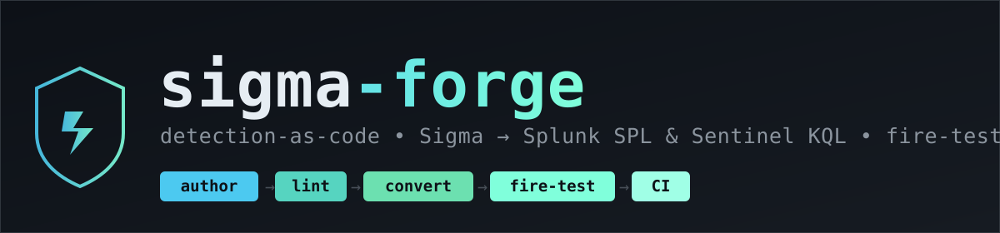
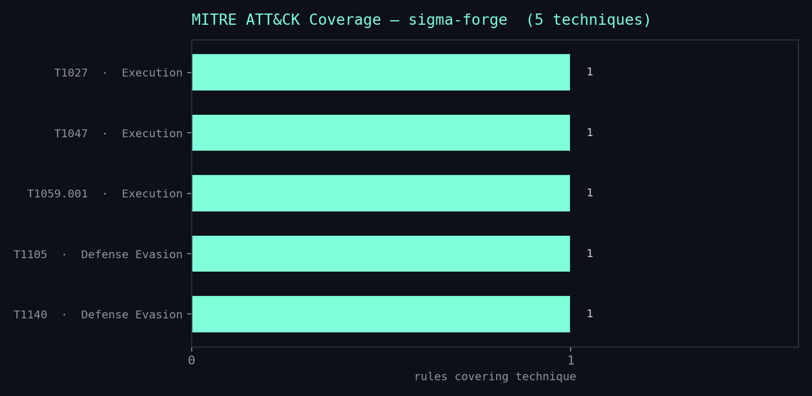
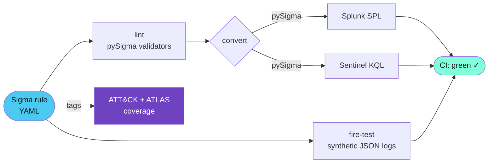
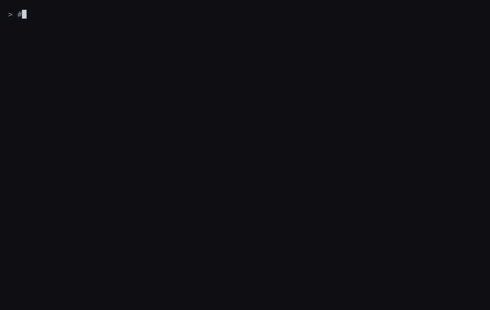

<div align="center">



# sigma-forge

**Detection-as-code: author Sigma once → ship Splunk SPL & Microsoft Sentinel KQL, proven in CI.**

[](https://github.com/NotACop38/Sigma-Forge/actions/workflows/ci.yml)
[](LICENSE)
[](rules/LICENSE)
[](pyproject.toml)
[](https://github.com/astral-sh/ruff)
[](https://attack.mitre.org/)
[](https://atlas.mitre.org/)

</div>

<div align="center">

</div>

---

## What it is

**sigma-forge** is a detection-as-code starter that authors vendor-neutral **Sigma** rules and
converts them to **Splunk SPL** and **Microsoft Sentinel/Defender KQL** with pySigma. Every rule
is **fire-tested in CI** against synthetic JSON logs — so coverage claims are *proven*, not
asserted — and tagged to **MITRE ATT&CK** and **MITRE ATLAS**. Alongside a classic host-detection
pack, it ships an **AI/LLM-application threat pack** (OWASP Top 10 for LLM + ATLAS) and an
optional **local-first LLM rule drafter** gated by a deterministic validator.

---

## Highlights

- 🛡️ **Multi-backend** — one Sigma source compiles to Splunk SPL *and* Sentinel/Defender KQL, no copy-paste drift.
- ✅ **Fire-tested** — each rule must match positive sample logs and ignore negatives, enforced in CI.
- 🤖 **AI/LLM threat pack** — prompt injection, secret leakage, and token-cost abuse mapped to OWASP LLM + ATLAS.
- 🔒 **Local-first drafter** — draft new rules from a sentence via a *local* LLM; never accepts a rule that fails lint → convert → fire-test.
- 🗺️ **ATT&CK heatmap** — a Navigator layer + a rendered coverage PNG, generated from rule tags.

---

## Architecture



---

## Quickstart

```bash
# 1. Clone and install (uv handles the venv + sigma backends/pipelines)
git clone https://github.com/NotACop38/Sigma-Forge.git && cd Sigma-Forge
uv sync                                   # or: python -m venv .venv && pip install -r requirements.txt

# 2. Convert every rule to Splunk SPL + Sentinel KQL
uv run sigma-forge convert --all

# 3. Fire-test every rule against synthetic logs (positives match, negatives don't)
uv run sigma-forge evaluate --all

# 4. Build the ATT&CK Navigator layer + heatmap PNG
uv run sigma-forge coverage

# 5. Run the full suite (lint + convert goldens + fire-tests) — needs NO API keys
make test
```

<div align="center">

</div>

---

## Repo layout

```text
rules/            classic/ (ATT&CK)  +  llm/ (OWASP LLM + ATLAS)   — DRL-1.1
pipelines/        custom SPL + KQL processing pipelines for the llm_app logsource
sample_logs/      *.positive.json / *.negative.json fire-test fixtures
src/sigmaforge/   cli · convert · evaluate · coverage · lint · llm_schema · draft
tests/            test_lint · test_convert (golden snapshots) · test_evaluate · test_draft
docs/             threat-model.md · sigma-subset.md · images/ (banner, heatmap)
.github/          CI: lint → convert → fire-test → upload ATT&CK layer
```

---

## Detection packs

| Rule | ATT&CK / ATLAS | Logsource | Backends |
|------|----------------|-----------|----------|
| `win_encoded_powershell` | T1059.001, T1027 | `process_creation` | SPL · KQL |
| `win_certutil_download` | T1105, T1140 | `process_creation` | SPL · KQL |
| `win_wmic_process_create` | T1047 | `process_creation` | SPL · KQL |
| `llm_prompt_injection_phrases` | LLM01 · `AML.T0051` / `AML.T0054` | `llm_app` | SPL · KQL |
| `llm_secret_in_prompt` | LLM02 · `AML.T0057` | `llm_app` | SPL · KQL |
| `llm_token_cost_spike` | LLM10 · `AML.T0034` / `AML.T0029` | `llm_app` | SPL · KQL |

<details>
<summary><b>Full rule metadata</b></summary>

Every rule carries a unique UUID `id`, `status`, `level`, `description`, `author`, a valid
`logsource`, and ATT&CK/ATLAS/OWASP tags. The classic pack uses standard SigmaHQ
`process_creation` field names (`Image`, `CommandLine`, `ParentImage`) so it converts cleanly
through the Sysmon (SPL) and Microsoft XDR (KQL) pipelines. The AI/LLM pack uses the synthetic
`llm_app` logsource defined in [`docs/sigma-subset.md`](docs/sigma-subset.md).

</details>

---

## Example output

A single Sigma rule (`win_encoded_powershell`, ATT&CK **T1059.001 + T1027**) converts to both
backends:

**Splunk SPL** (Sysmon pipeline)
```spl
EventID=1 Image IN ("*\\powershell.exe", "*\\pwsh.exe") CommandLine IN ("* -enc *", "* -EncodedCommand *", "* -ec *", "*FromBase64String*")
```

**Microsoft Sentinel/Defender KQL** (Microsoft XDR pipeline)
```kql
DeviceProcessEvents
| where (FolderPath endswith "\\powershell.exe" or FolderPath endswith "\\pwsh.exe")
    and (ProcessCommandLine contains " -enc " or ProcessCommandLine contains " -EncodedCommand "
         or ProcessCommandLine contains " -ec " or ProcessCommandLine contains "FromBase64String")
```

And an AI/LLM rule (`llm_token_cost_spike`) compiles against the custom `LLMAppLogs_CL` table:
```kql
LLMAppLogs_CL
| where PromptTokens >= 8000 or CompletionTokens >= 8000
```

---

## AI/LLM threat model

The AI/LLM pack maps log-observable risks on a fictional **LLM gateway** to public frameworks —
**OWASP Top 10 for LLM Applications** and **MITRE ATLAS**. Full narratives, technique IDs, and
honest limitations are in **[`docs/threat-model.md`](docs/threat-model.md)**.

---

## Optional: local-first rule drafter

Draft a new rule from a plain-English sentence using a **local** LLM — then let a deterministic
validator decide whether to keep it:

```bash
# Points at LM Studio / Ollama / vLLM by default (OPENAI_BASE_URL=http://localhost:1234/v1)
uv run sigma-forge draft "detect base64-encoded PowerShell downloads" --out rules/classic/drafted.yml
```

> **Guardrail:** the drafter pipes the model's YAML through **lint → convert (SPL + KQL) →
> fire-test**. A rule that fails any stage is rejected and **never written to disk**. The model is
> local by default, and **CI/tests mock it entirely — zero network calls, zero API keys**.

---

## How CI works

On every push and PR (Python 3.11): `uv sync` → **ruff** + **mypy** → convert *all* rules to SPL
and KQL (fail on any conversion error) → **pytest** (lint, golden conversions, fire-tests) →
upload the ATT&CK Navigator layer JSON as an artifact. A separate **gitleaks** job scans for
secrets.

---

<details>
<summary><b>Limitations &amp; scope</b></summary>

- **KQL for the custom LLM logsource.** The AttackIQ Kusto backend is built around Microsoft's
  native tables. sigma-forge targets a *custom* `LLMAppLogs_CL` Log Analytics table via the
  backend's `query_table` pipeline state; the column names are an illustrative convention for the
  synthetic schema, **not** a Microsoft-defined table. Validate against your real table before use.
- **Evaluator subset.** The offline fire-test evaluator supports a documented subset
  (equals/contains/startswith/endswith/`re`/`null`/`all` + numeric compares + keywords). Constructs
  like `base64offset`, `cidr`, and `fieldref` convert to SPL/KQL fine but raise a clear error in the
  evaluator rather than guessing. See [`docs/sigma-subset.md`](docs/sigma-subset.md).
- **Detections are starting points.** Phrase lists, regexes, and thresholds are illustrative and
  authored from public sources — tune them per environment.
- **Synthetic everything.** All logs, fields, and identifiers are fictional and product-agnostic.

</details>

---

## License

- **Code** — [MIT](LICENSE).
- **Detection rules** (`rules/`) — [Detection Rule License (DRL) 1.1](rules/LICENSE), the same
  permissive license SigmaHQ uses for community content.

## Acknowledgments

Built on the work of [**SigmaHQ**](https://github.com/SigmaHQ/sigma) and
[**pySigma**](https://github.com/SigmaHQ/pySigma), the
[**AttackIQ pySigma Kusto backend**](https://github.com/AttackIQ/pySigma-backend-kusto), the
[**OWASP Top 10 for LLM Applications**](https://owasp.org/www-project-top-10-for-large-language-model-applications/),
and [**MITRE ATT&CK**](https://attack.mitre.org/) + [**MITRE ATLAS**](https://atlas.mitre.org/).
