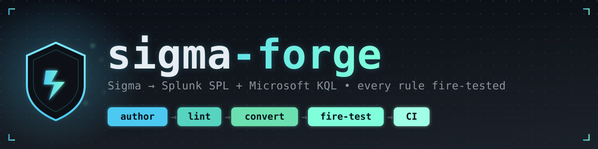
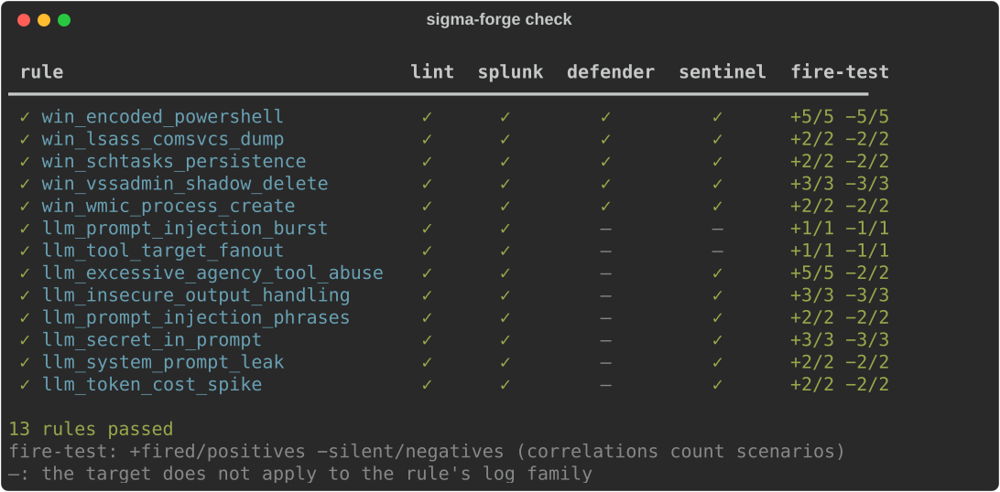
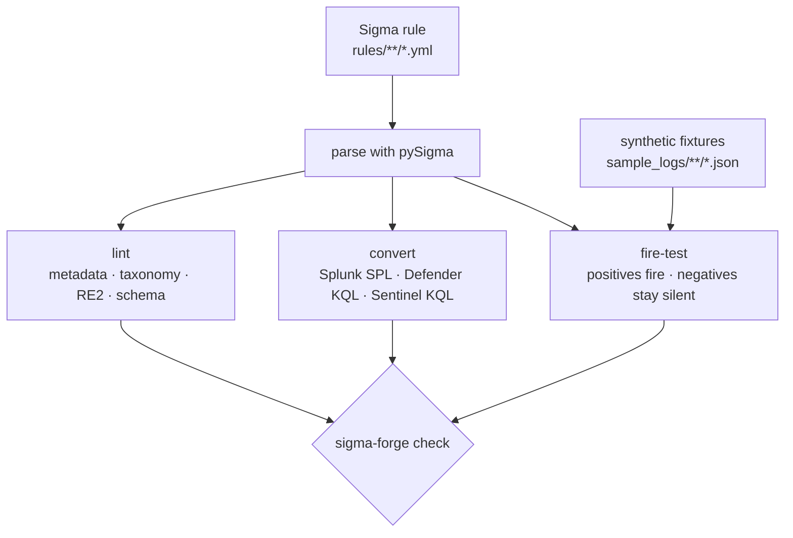
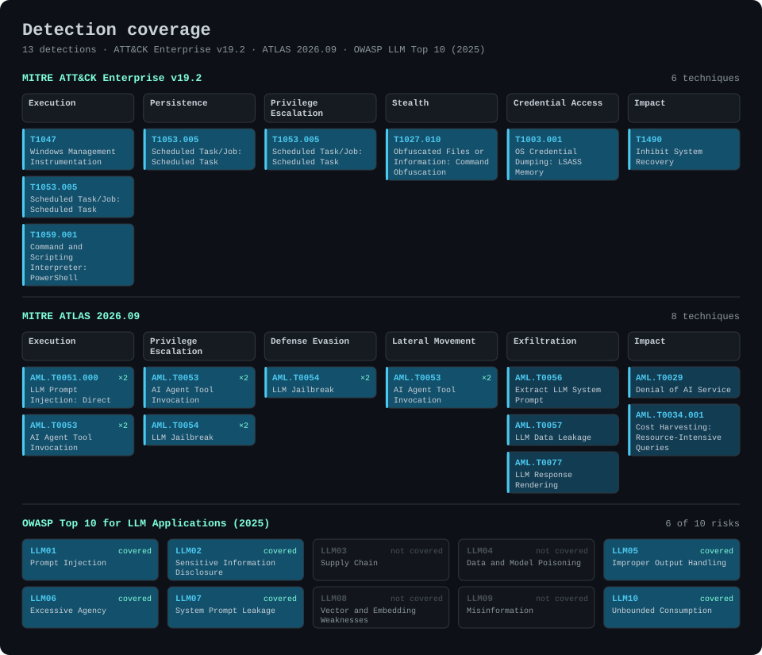

<div align="center">



**Detection-as-code for Sigma. Write a rule once, compile it to Splunk SPL and Microsoft KQL, and prove it against synthetic logs before it ships.**

[](pyproject.toml)
[](LICENSE)
[](rules/LICENSE)
[](https://attack.mitre.org/)
[](https://atlas.mitre.org/)
[](https://genai.owasp.org/llm-top-10/)

[Quickstart](#quickstart) · [How it works](#how-it-works) · [Detections](#detections) · [Example](#example) · [CLI](#cli) · [Rule drafter](#local-rule-drafter) · [Limitations](#limitations)

</div>

## Overview

sigma-forge is a detection-as-code toolkit and rule set built on
[pySigma](https://github.com/SigmaHQ/pySigma). Every rule passes one gate,
`sigma-forge check`, before it is considered done:

- **Lint.** The rule carries complete metadata and a public reference, its tags
  resolve against pinned MITRE ATT&CK v19.2, MITRE ATLAS 2026.09, and OWASP LLM
  Top 10 (2025) data, and it avoids constructs that do not port to every backend.
- **Convert.** It compiles for every target its log family supports: Splunk
  SPL, Microsoft Defender XDR KQL, and Microsoft Sentinel KQL. The test suite
  also compares each output with a reviewed snapshot.
- **Fire-test.** An offline Sigma evaluator runs the rule against synthetic
  fixtures: every positive event must fire, and every negative near-miss must
  stay silent. Correlation scenarios must hold under both sliding windows and
  the fixed time buckets the generated SPL uses.

The repository ships 13 detections that pass this gate: five for Windows process
creation, six for a synthetic LLM gateway (prompt injection, secret leakage,
unsafe output, excessive agency, system prompt leakage, and token abuse), and
two correlations. An optional drafter turns a threat description into a new
rule and fixtures with a model running on your machine, and accepts the result
only if it passes the same gate.

Everything except the drafter and the maintainer-only taxonomy refresh runs
offline with no API keys, and the test suite fails any network connection
outside loopback.

<div align="center">

</div>

## Quickstart

sigma-forge uses [uv](https://docs.astral.sh/uv/) and requires Python 3.11 or later.

```bash
git clone https://github.com/NotACop38/Sigma-Forge.git && cd Sigma-Forge
uv sync                                    # virtualenv with pinned dependencies

uv run sigma-forge check                   # lint, convert, and fire-test every rule
uv run sigma-forge convert rules/classic/win_vssadmin_shadow_delete.yml
uv run sigma-forge coverage                # ATT&CK Navigator layer and coverage card
make test                                  # every CI gate, offline
```

Without uv: `python -m venv .venv && . .venv/bin/activate && pip install -r requirements.txt -e .`,
then run the same commands without `uv run`.

## How it works


```mermaid
flowchart TB
    R["Sigma rule<br/>rules/**/*.yml"] --> P["parse with pySigma"]
    P --> L["lint<br/>metadata · taxonomy · RE2 · schema"]
    P --> C["convert<br/>Splunk SPL · Defender KQL · Sentinel KQL"]
    P --> F["fire-test<br/>positives fire · negatives stay silent"]
    X["synthetic fixtures<br/>sample_logs/**/*.json"] --> F
    L --> V{"sigma-forge check"}
    C --> V
    F --> V
```

| Stage | What it guarantees |
|---|---|
| Parse | Rules are parsed by pySigma, never by a hand-written parser. Condition syntax errors fail at load time. |
| Lint | Required metadata (`id`, `title`, `status`, `level`, `description`, `author`, `date`, tags, an `https://` reference); ATT&CK, ATLAS, and OWASP tags that exist in the pinned taxonomies, with each ATT&CK tactic tag belonging to a tagged technique; no keyword detections (the Kusto backend compiles them to invalid KQL); only RE2-compatible regular expressions (KQL uses RE2); LLM rules restricted to the event schema's fields; unique ids, names, and titles across the rule set; pySigma's core validators, except those that download data or contradict each other. |
| Convert | In-process pySigma backends with one processing pipeline per log family. In `make test` and CI, every output must also match its reviewed snapshot in `tests/golden/`. |
| Fire-test | The evaluator compiles each rule's condition tree once, rejects unsupported constructs up front (even in branches the fixtures never reach), bounds rule regular expressions with a timeout, and validates LLM fixture events against the schema. |
| Workspace | No rule may be missing its fixtures, and no fixture may outlive its rule. |

Conversion targets by log family:

| Target | Query language | Windows process creation | LLM gateway (`llm_app`) |
|---|---|---|---|
| `splunk` | Splunk SPL | Sysmon pipeline | `llm_splunk.yml`, scoped to `sourcetype="llm:gateway"` |
| `defender` | Microsoft Defender XDR KQL | `DeviceProcessEvents` | not applicable |
| `sentinel` | Microsoft Sentinel KQL | ASIM `imProcessCreate` | custom table `LLMAppLogs_CL` |

Correlation rules compile to Splunk only; pySigma's Kusto backend does not
implement Sigma correlations. The supported Sigma subset and the exact matching
semantics are specified in [`docs/sigma-subset.md`](docs/sigma-subset.md).

## Detections

### Windows process creation (MITRE ATT&CK v19.2)

| Rule | Detects | ATT&CK |
|---|---|---|
| `win_encoded_powershell` | PowerShell with `-EncodedCommand` or any abbreviation of it, written with `-`, `/`, or a Unicode dash, or in-line `FromBase64String` | T1059.001 PowerShell, T1027.010 Command Obfuscation |
| `win_lsass_comsvcs_dump` | `rundll32` calling the `comsvcs.dll` MiniDump export | T1003.001 LSASS Memory |
| `win_schtasks_persistence` | `schtasks.exe /create` | T1053.005 Scheduled Task |
| `win_vssadmin_shadow_delete` | `vssadmin` deleting shadow copies or shrinking shadow storage | T1490 Inhibit System Recovery |
| `win_wmic_process_create` | `wmic process call create` | T1047 Windows Management Instrumentation |

### LLM gateway (OWASP Top 10 for LLM Applications 2025, MITRE ATLAS)

| Rule | Detects | OWASP | ATLAS |
|---|---|---|---|
| `llm_prompt_injection_phrases` | Override and jailbreak phrases in the prompt | LLM01 | AML.T0051.000, AML.T0054 |
| `llm_secret_in_prompt` | AWS access key IDs, `sk-` API keys, or PEM private keys in the prompt or completion | LLM02 | AML.T0057 |
| `llm_insecure_output_handling` | Script or iframe tags, `javascript:` URIs, event handlers, destructive SQL, or Markdown-image exfiltration URLs in the completion | LLM05 | AML.T0077 |
| `llm_excessive_agency_tool_abuse` | Shell, file-deletion, email, or HTTP tools aimed at loopback, private, internal, or cloud-metadata hosts | LLM06 | AML.T0053 |
| `llm_system_prompt_leak` | Completions that echo system-prompt or instruction markers | LLM07 | AML.T0056 |
| `llm_token_cost_spike` | A single request with at least 8,000 prompt or completion tokens | LLM10 | AML.T0034.001, AML.T0029 |

### Correlations

| Rule | Signal | OWASP | ATLAS |
|---|---|---|---|
| `llm_prompt_injection_burst` | `event_count`: at least 3 injection attempts by one `user.id` within 10 minutes | LLM01 | AML.T0051.000, AML.T0054 |
| `llm_tool_target_fanout` | `value_count`: tool requests by one `user.id` to at least 5 distinct hosts within 5 minutes | LLM06 | AML.T0053 |

The threat narratives, mappings, and per-rule limitations are in
[`docs/threat-model.md`](docs/threat-model.md). `sigma-forge coverage`
generates an [ATT&CK Navigator layer](docs/attack-layer.json) and this card
from the rule tags:

<div align="center">

</div>

## Example

One rule, `win_vssadmin_shadow_delete`, compiles to three platforms. The
pipelines rename fields and pick the right table, so the logic is written once:

```yaml
detection:
  selection_img:
    Image|endswith: '\vssadmin.exe'
  selection_delete:
    CommandLine|contains|all:
      - 'delete'
      - 'shadows'
  selection_resize:
    CommandLine|contains|all:
      - 'resize'
      - 'shadowstorage'
  condition: selection_img and (selection_delete or selection_resize)
```

Splunk SPL (Sysmon):

```text
EventID=1 Image="*\\vssadmin.exe" (CommandLine="*delete*" CommandLine="*shadows*") OR (CommandLine="*resize*" CommandLine="*shadowstorage*")
```

Microsoft Defender XDR:

```kql
DeviceProcessEvents
| where FolderPath endswith "\\vssadmin.exe" and ((ProcessCommandLine contains "delete" and ProcessCommandLine contains "shadows") or (ProcessCommandLine contains "resize" and ProcessCommandLine contains "shadowstorage"))
```

Microsoft Sentinel (ASIM):

```kql
imProcessCreate
| where TargetProcessName endswith "\\vssadmin.exe" and ((TargetProcessCommandLine contains "delete" and TargetProcessCommandLine contains "shadows") or (TargetProcessCommandLine contains "resize" and TargetProcessCommandLine contains "shadowstorage"))
```

Its fixtures prove each branch: the positives include `vssadmin.exe delete shadows /all /quiet`
and `vssadmin.exe resize shadowstorage /for=C: /on=C: /maxsize=401MB`; the
negatives include near misses such as `vssadmin list shadowstorage` and
`cmd /c echo delete shadows`.

## CLI

| Command | Purpose |
|---|---|
| `sigma-forge check [PATHS...] [--json]` | Lint, convert, and fire-test rules, and check that ids, names, and titles are unique. With no paths it also flags fixtures whose rule is gone. `--json` prints a machine-readable report. |
| `sigma-forge convert [PATHS...] [-t splunk\|defender\|sentinel]` | Print the compiled queries for each rule. |
| `sigma-forge coverage [--check]` | Write `docs/attack-layer.json` and `docs/images/coverage.svg`; `--check` writes nothing and fails if they are out of date. |
| `sigma-forge draft "THREAT" [--write] [--name NAME]` | Draft a rule and fixtures with a local model (see below). |

Every command accepts `--root DIR`; by default the workspace is the nearest
directory, from the current one upwards, that contains `rules/`. Exit codes:
`0` success, `1` a gate failed, `2` usage error.

## Local rule drafter

`sigma-forge draft` asks a model for a Sigma rule plus positive and negative
fixture events, then runs the draft through the same gate as a committed rule,
with one extra check: the rule must not fire on an empty event, which catches
over-broad `not filter` conditions. When a stage fails, the errors go back to
the model for another attempt (three by default). Nothing is written unless a
draft passes, and existing files are never overwritten.

```bash
export SIGMA_FORGE_LLM_BASE_URL=http://127.0.0.1:1234/v1   # LM Studio default
export SIGMA_FORGE_LLM_MODEL=your-local-model
uv run sigma-forge draft 'rundll32 loading a DLL from C:\Users\Public' --write
```

Any OpenAI-compatible server works, such as LM Studio, Ollama
(`http://127.0.0.1:11434/v1`), llama.cpp, or vLLM. The drafter:

- sends the threat description only to a loopback address unless you pass
  `--allow-remote`, and bypasses HTTP proxies for loopback traffic;
- reads its own `SIGMA_FORGE_LLM_*` variables (see [`.env.example`](.env.example)),
  so a global `OPENAI_API_KEY` is never picked up by accident;
- assigns a fresh UUID, `status: experimental`, and today's date to every draft;
- writes `rules/<pack>/<name>.yml` and both fixture files with `--write`.

A drafted rule is a starting point: review it, run `make golden`, and commit it
like any other rule. The tests mock the model completely and never call a server.

## Project layout

```text
rules/                   Sigma rules (DRL 1.1): classic/ (Windows), llm/, correlation/
sample_logs/             synthetic fixtures, mirroring rules/: <name>.positive.json, <name>.negative.json
src/sigmaforge/
  check.py               the gate: lint, convert, fire-test, workspace checks
  lint.py                metadata policy, taxonomy tags, RE2 portability, schema fields
  convert.py             pySigma backends and pipelines per target
  evaluate.py            offline Sigma evaluator for rules and correlations
  firetest.py            fixture loading and verdicts
  coverage.py            ATT&CK Navigator layer and SVG coverage card
  draft.py               local-model drafter and its repair loop
  taxonomy.py            pinned ATT&CK, ATLAS, and OWASP lookups
  llm_schema.py          synthetic LLM gateway event schema
  workspace.py           repository layout and rule loading
  cli.py                 command-line interface
  pipelines/             Splunk and Sentinel pipelines for the llm_app logsource
  data/                  ATT&CK v19.2 and ATLAS 2026.09 snapshots, with notices
tests/                   pytest suite; golden/ holds the conversion snapshots
scripts/                 taxonomy refresh and README image rendering
docs/                    evaluation contract, threat model, generated coverage artifacts
```

## Development

| Command | Does |
|---|---|
| `make install` | `uv sync`: runtime and development dependencies |
| `make test` | Every CI gate: ruff, strict mypy, pytest with at least 90% branch coverage, `sigma-forge check`, and `sigma-forge coverage --check` |
| `make golden` | Regenerate the conversion snapshots after an intended change; review the diff |
| `make docs` | Regenerate the coverage layer, the coverage card, and the gate output image |
| `make taxonomy` | Refresh the ATT&CK and ATLAS snapshots from MITRE (network; maintainers) |
| `make requirements` | Re-export `requirements.txt` from `uv.lock` |

CI runs on every push and pull request. A Python 3.11, 3.12, and 3.13 matrix
runs the `make test` gates; the 3.11 job also checks that `requirements.txt`
matches `uv.lock` and installs the built wheel into a clean environment to run
`sigma-forge check` outside the source tree. A separate job scans the full git
history with a checksum-verified gitleaks binary and plants a canary secret to
prove the allowlist stays narrow.

See [`CONTRIBUTING.md`](CONTRIBUTING.md) for the rule-authoring workflow and
[`CHANGELOG.md`](CHANGELOG.md) for release notes.

## Limitations

- **Sigma semantics, not backend execution.** The fire-test runs each rule's
  Sigma logic against the fixtures; there is no offline Splunk or Kusto engine.
  The golden snapshots record what each backend emits, and
  [`docs/sigma-subset.md`](docs/sigma-subset.md#limitations) lists where backend
  behaviour can differ.
- **Correlations compile to Splunk only.** pySigma's Kusto backend does not
  implement Sigma correlations.
- **Illustrative schema names.** `sourcetype="llm:gateway"`, the
  `LLMAppLogs_CL` table, and its columns are conventions for the synthetic
  schema, not Splunk or Microsoft definitions. Map them to your own ingestion.
- **Windows rules match on `Image` only.** The Sentinel ASIM pipeline in
  pySigma-backend-kusto 1.0.1 maps `OriginalFileName` to a column that
  `imProcessCreate` does not have, so renamed binaries are not covered.
- **Starting points, not tuned detections.** Phrase lists, regular expressions,
  and thresholds come from public sources and need tuning to your environment.
- **Synthetic data.** Every event, host, identifier, and credential in the
  fixtures is fictional.

## Security

sigma-forge is defensive and educational. To report a vulnerability privately,
follow [`SECURITY.md`](SECURITY.md).

## License

- Code: [MIT](LICENSE).
- Detection rules in `rules/`: [Detection Rule License 1.1](rules/LICENSE), the
  license SigmaHQ uses for community rules.
- Taxonomy snapshots in `src/sigmaforge/data/`: MITRE ATT&CK terms of use and,
  for ATLAS, the Apache License 2.0; see the [notice](src/sigmaforge/data/NOTICE.md).

## Acknowledgments

Built on [SigmaHQ](https://github.com/SigmaHQ/sigma) and
[pySigma](https://github.com/SigmaHQ/pySigma), with the
[pySigma Splunk backend](https://github.com/SigmaHQ/pySigma-backend-splunk), the
[AttackIQ pySigma Kusto backend](https://github.com/AttackIQ/pySigma-backend-kusto),
and the [pySigma Sysmon pipeline](https://github.com/SigmaHQ/pySigma-pipeline-sysmon).
Mappings come from [MITRE ATT&CK](https://attack.mitre.org/),
[MITRE ATLAS](https://atlas.mitre.org/), and the
[OWASP Top 10 for LLM Applications](https://genai.owasp.org/llm-top-10/).
ATT&CK® and ATLAS™ are trademarks of The MITRE Corporation.
